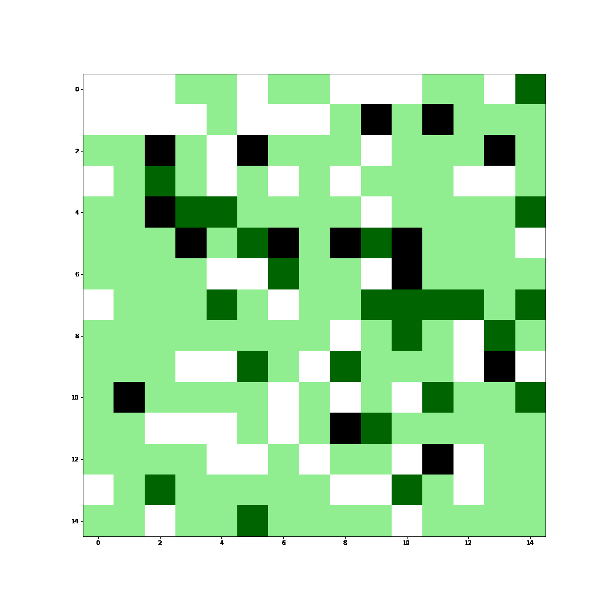
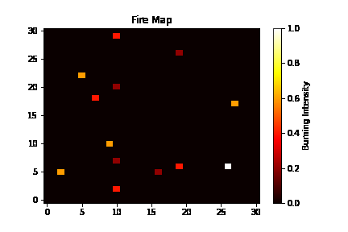

# FireFighting_RL
A repo for ME5418 Machine Learning in Robotics by Group 16 ([Li Hongyi](https://github.com/LuyiLi), [Lyu Le](https://github.com/rulerlock), and [Pan Yongzhou](https://github.com/YongzhouPan))
## Testing of the environment:
To set up the python environment, please use `requirements.txt` (Same as the SAPP_Env).

In `TestEnv.ipynb`, random action is executed for several rounds, and the map showing the current agent state is plotted.

