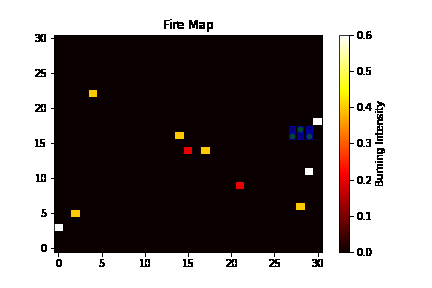
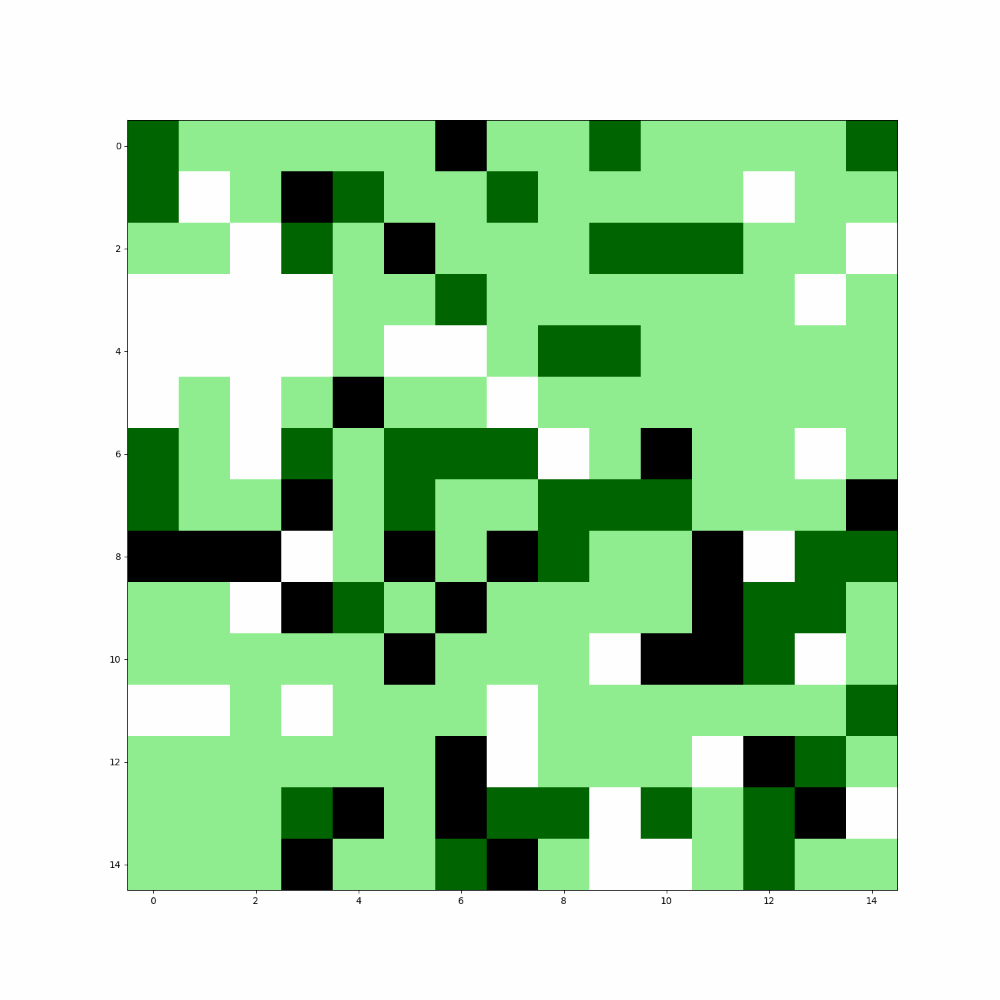

# FireFighting_RL
The project for ME5418 Machine Learning in Robotics by Group 16 ([Li Hongyi](https://github.com/LuyiLi), [Lyu Le](https://github.com/rulerlock), and [Pan Yongzhou](https://github.com/YongzhouPan))

## Table of Content
* __[Introduction](#introduction)__
* __[Setup](#setup)__
* __[Environment](#environment-generation)__
* __[Neural Network](#neural-network)__
* __[Learning Agent](#learning-agent)__


## Introduction
The intelligent multi-robot system emerges as a promising solution to address the challenges posed by large-scale disasters. In the context of a wildfire firefighting scenario, this project introduces a multi-robot-based approach to wildfire response. Each robot can only plan its movements based on local environmental sensing and requires cooperation with other agents in the system.

Considering the dynamic changes in the environment, the complexity of the problem surpasses the capabilities of conventional model-based algorithms. Exploring learning-based methods becomes an appealing and viable solution. To manage the complexity of the problem, our project restricts agent action decisions to a 2D grid map.

## Setup
To configure the python interpreter, please create a virtual environment and install the required packages described in `requirements.txt`.

```
conda create -n firefight_env python=3.9
conda activate firefight_env
pip install -r requirements.txt
```

Please be aware that a version of `torch` higher than `1.13.1` is acceptable. We have successfully tested our program with `torch 2.1.0`, and it performed as expected. However, it is important to note that a version of `torch` lower than `1.13.1`may not work correctly. For example, our testing with `torch 1.10.1` resulted in a failure to execute the program.

Our code can be deployed on `Ubuntu 18.04`and `Ubuntu 20.04`. The GPU of our training lattop is `NVIDIA GeForce RTX 3080`, and the CUDA version is `11.3`.

## Environment Generation
Our environment map is regenerated after each reset. In the figure below, black grids represent obstacles, green grids represent trees, light green grids represent grass, white grids represent sand, blue grids represent water supply stations, and red grids represent agents.

<p align="center">
    
</p>

In accordance with TA's suggestions and our actual needs, we continuously enhance the visualization effects of our environment.

Our environmental visualization has been fully tested in `TestEnv.ipynb` and has been implemented in the subsequent procedures. During our test, some random actions were executed for several rounds, and the GIFs showing the agent state variation have been generated.

<p align="center">
    
</p>



## Neural Network


### Neural Network Improvements
We have constructed two networks with the same architecture, `ACNet` and `ACNet_pytorch`, based on `TensorFlow` and `PyTorch`, respectively. During the initial testing phase, we utilized the TensorFlow-based network and encountered challenges related to CUDA compatibility, limiting us to training the model solely on the CPU of our `RTX 3080` laptop.

Moreover, TensorFlow 1 lacks the newer built-in network structure, presenting potential obstacles for experimentation. Drawing on our past experience with CNNs, we recognize that GPU utilization significantly enhances training performance, reducing the training duration from 13 minutes to just 70 seconds.

Consequently, despite the considerable effort required for reconstruction, we chose to overhaul our previous neural network to exploit PyTorch for expedited training and improved scalability.


### Neural Network Structures
The network architecture is defined as follows: the input tensors are fed into convolutional layers (`conv1`, `conv2`, `conv3`) and max-pooling layers (`pool1`, `pool2`). These layers work in tandem to process the input data, and at each step of the CNN, the data is transformed and subsequently flattened. The structure of our network is shown as follows.

## Learning Agent

